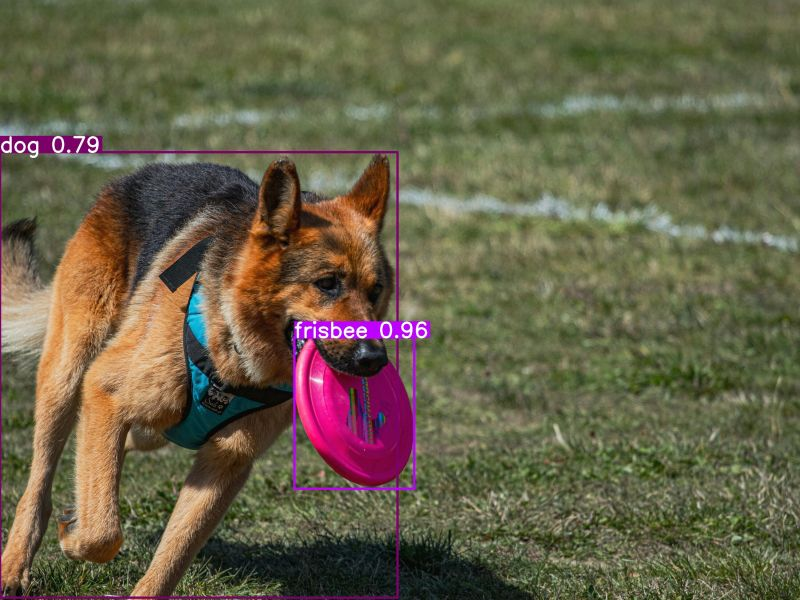

## Project Overview
This project demonstrates an object detection model trained to identify various objects within images using deep learning. In this example, the model detects a German Shepherd dog holding a frisbee, accurately highlighting each object with bounding boxes and associated confidence scores. This type of model can be used for a range of applications, from automated image tagging to real-time detection in video streams.

## Features
- **Multi-object Detection**: Detects multiple objects within a single image, such as animals and commonly found items.
- **Bounding Box Annotations**: Each detected object is marked with a bounding box and labeled with a confidence score, making it easy to identify detected objects and their locations.
- **High Accuracy**: Leveraging state-of-the-art deep learning models, the detection achieves high confidence, shown in this example as a 0.96 confidence score for detecting the frisbee.
- **Real-world Applications**: This project can be adapted for applications like autonomous vehicles, wildlife monitoring, and security systems.

> [!TIP]
> For a quick start, try using pre-trained models to see results without a full training process. 

## Example Output
Here is a sample output from the model:

*In this image, the model successfully identifies the dog with a 0.79 confidence score and the frisbee with a 0.96 confidence score.*

> [!NOTE]
> The example image showcases the model’s ability to recognize objects and their confidence levels, giving you insight into how well the model performs.

## Technologies Used
- **Frameworks**: TensorFlow, PyTorch
- **Languages**: Python
- **Libraries**: OpenCV, NumPy, and Matplotlib for image processing and display

> [!IMPORTANT]
> It’s essential to install all dependencies for TensorFlow or PyTorch before running the model.

## How It Works
The model is trained on a dataset of labeled images to learn the features of different objects. Once trained, the model can predict the presence and location of objects in new images by drawing bounding boxes around them and assigning confidence scores.

### Steps
1. **Data Collection**: Gather images of various objects you want the model to detect.
2. **Labeling**: Annotate the images by drawing bounding boxes and labeling each object.
3. **Training**: Train the model on the labeled dataset.
4. **Evaluation**: Test the model on a validation dataset to check its accuracy.
5. **Deployment**: Deploy the model to detect objects in real-time or in batch-processed images.

> [!CAUTION]
> Training on a large dataset requires significant computational power. Consider using a cloud-based GPU if you don’t have one available.

## Future Work
- **Expand Object Categories**: Increase the variety of objects the model can detect.
- **Real-time Detection**: Optimize the model for real-time object detection in video streams.
- **Model Optimization**: Improve model speed and accuracy for deployment on edge devices.

> [!WARNING]
> Make sure your dataset is well-labeled and diverse, as poor-quality data can significantly impact model accuracy.

